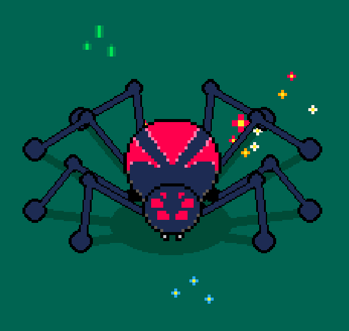
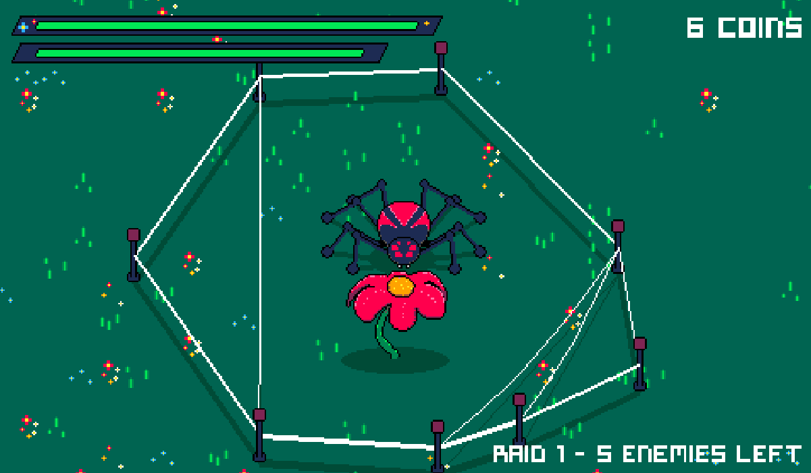
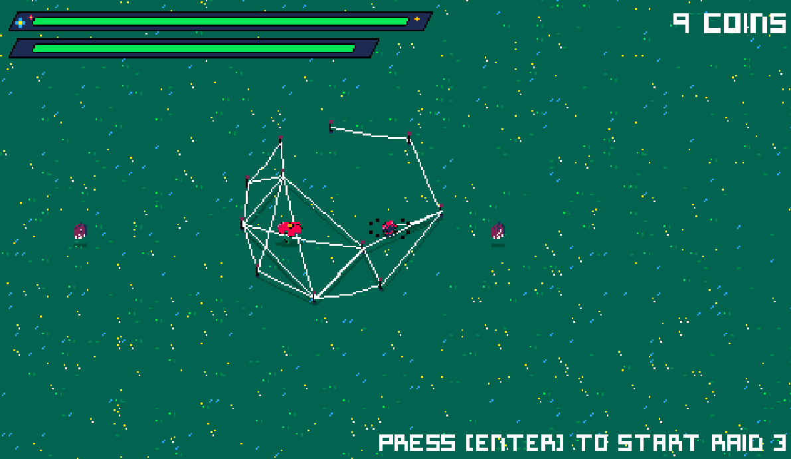

# Arachnoforge

<div align="center">
    
</div>

**Arachnoforge** is a 2D game where players control a spider character, fight with enemies and protect a flower from being destroyed. The game is designed to be played with a mouse and keyboard, providing an engaging experience for players of all ages. The objective is to defeat enemies, collect items, and upgrade the spider's abilities while navigating through various levels. 

Features unique mechanics such as web creation, item collection, and raid battles, offering an engaging and challenging experience.

The game is made with a custom game engine called **Motor**, responsible for the core functionalities of the game, including rendering, physics, and API utilities. The engine is designed to be modular and extensible, allowing for easy integration of new features and improvements. 

<div align="center">
    
</div>

## Features

- **Playable Spider Character**: Control a spider with customizable abilities like shooting webs, collecting coins, and upgrading stats.
- **Dynamic Enemies**: Fight against various enemies such as bees, beetles, and flies, each with unique behaviors and attack patterns.
- **Interactive Items**: Collect items like "More Shoots Card" and "Shoot Time Card" to enhance your abilities.
- **Web Mechanics**: Create and manage web strings and nodes to navigate the environment and trap enemies.
- **Raid Mode**: Engage in challenging raid battles with increasing difficulty levels.
- **Health and Resource Management**: Manage health, coins, and other resources to survive and progress.
- **Visual Effects**: Enjoy particle effects, animations, and dynamic rendering for an immersive experience.
- **Sound and Music**: Experience a rich audio environment with background music and sound effects.

<div align="center">
    
</div>

### Item Upgrades

- **More Shoots Card**: Increases the spider's shooting quantity.
- **Shoot Time Card**: Reduces the delay between shots.

### Visual Effects

- **Explosions**: Visual effects for enemy destruction.
- **Particles**: Dynamic particle systems for various interactions.

## Project Structure

The project is organized into the following directories:

- **`assets/`**: Contains game assets such as images, sounds, and fonts.
- **`build/`**: Compiled or generated files for the game.
- **`data/`**: Stores game data like level configurations.
- **`game/`**: Core game logic, including characters, effects, items, scenes, and tilemaps.
- **`motor/`**: The custom game engine, including core functionalities like rendering, physics, and API utilities.

## Download
If you don't want to build the game from source, you can download the latest version of Arachnoforge from the [game page on itch.io](https://joecavzero.itch.io/arachnoforge).

## Installation
You can also build the game from source. Follow these steps to set up the game on your local machine:
1. Clone the repository:
   ```bash
   git clone https://github.com/your-repo/arachnoforge.git
2. Install dependencies:
    ```bash
    pip install pygame-ce
    pip install numpy
    pip install pandas
    ```
3. Run the game:
    ```bash
    python main.py
    ```